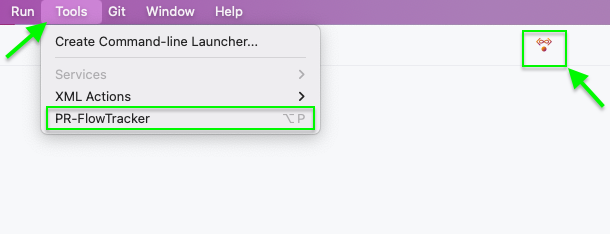

# PR-FlowTracker Quick Start

### PR-FlowTracker is a plugin that allows you to efficiently manage and track Pull Requests (PRs) directly within your JetBrains IDE.

> **_Please note that any actions or decisions related to pull requests should be taken after reviewing the pull requests directly on GitHub._**
> **_PR-FlowTracker provides a comprehensive overview and status of your PRs._**

---

## Before We Start

Before using PR-FlowTracker, ensure that you have checked the [Prerequisites.md](https://github.com/itRunFenix/PR-FlowTracker-plugin/blob/master/Prerequisites.md) file and prepared your environment.

---

## Quick Start Guide

### 1. **Install the Plugin**

To get started with PR-FlowTracker, install the plugin from the JetBrains Marketplace.

### 2. **Accessing the Plugin**

Once installed, access PR-FlowTracker from both the **Main Toolbar Center** and the **Tools Menu** in your JetBrains IDE:

- **Main Toolbar Center**
- **Tools Menu**
- **Alt+P** Keyboard Shortcuts

  

If you do not want the plugin in the Main Toolbar Center, you can simply customize the toolbar and remove the plugin from the center location.
After that, you will still be able to use the plugin through the Tools tab.

---

### 3. **Overview of Key Features**

PR-FlowTracker offers several powerful tabs to manage your PRs:

#### **Tab: Overview**
The **Overview** tab provides a summary report of all your open Pull Requests, helping you quickly assess the state of your ongoing PRs.

Upon opening this tab, you will be presented with a personalized report, such as:

```bash
Welcome itRunFenix!
Here’s your personalized open Pull Request report:

Repository: itRunFenix/PR-FlowTracker-plugin

Total PRs: 6
Conflicted: 3
Changes Requested: 2
Pending Review: 2
Merge-Ready with Issues: 0
Fully Merge-Ready!: 1
```
This report gives you a quick glance at the state of all your open PRs, categorized by their status.

In addition, in the Overview tab, you can take the following actions:

- **View PRs Details**: Displays detailed information about all open Pull Request(s), including the title, author, review status, and other relevant data. This allows you to easily track the progress and review requirements for each PR.
- **View Merged PRs**: Shows recently merged PRs for easy tracking.

#### **Tab: Review Track**
- **Check Merge Conflicts**: Identifies any PRs with merge conflicts, allowing you to resolve them quickly.
- **Check Changes Requested**: Lists PRs where reviewers have requested changes, providing insight into current review needs.
- **Check Pending PRs Reviews**: Shows PRs awaiting review, ensuring you can follow up promptly.
- **Check Merge-ready Issues**: Identifies PRs that are ready to be merged but have some issues that need to be addressed before proceeding.
- **Check Fully Merge-ready PRs**: Displays PRs that are fully ready for merging and do not have any blockers, streamlining the merging process.

#### **Tab: PR Health Checks**
- **Fetch ALL PR Statuses**: Collects the current status for all PRs, giving a complete picture of their state.
- **Fetch Failure Status**: Filters out PRs that have failed checks, helping to identify issues that need attention.
- **Fetch Pending Status**: Identifies PRs that are still pending, allowing for efficient monitoring of ongoing reviews.
- **Fetch PR Status**: Retrieves the latest status for individual PRs, providing real-time updates on their progress and any issues that may have arisen.

#### **Tab: PR Insights**
- **Check Open PRs Labels**: Displays PRs categorized by labels, facilitating easy prioritization and organization.
- **Check PR Duration**: Tracks how long each PR has been open, assisting in identifying PRs that may require immediate action.

#### **Tab: My Repos**
The **My Repos** tab allows for advanced configuration, though it is optional. By default, PR-FlowTracker operates within the context of the current project path, but these powerful settings enable you to browse and manage all your repositories without the need to switch contexts, even if you are working on a non-Git project.

- **Fetch Repositories**: Click this button to fetch/refresh the list of repositories and ensure you have the latest list of your repos.
- **Activate Repository**: Use the checkbox to select the repository you want to activate, allowing focused actions and operations on the selected repository.
- **Apply Changes**: After making adjustments, such as activating a repository, click 'Apply' to save your changes and ensure they take effect.

### 4. **Configure the Plugin**
PR-FlowTracker settings are project-specific, allowing you to switch between projects easily:

- **Repository Path**: Set the path to your desired repository, even if it differs from the current project. This allows seamless PR tracking across multiple repositories.

### 5. **Troubleshooting**
If you encounter any issues:

- Ensure that all required tools are installed and properly configured. [Prerequisites.md](https://github.com/itRunFenix/PR-FlowTracker-plugin/blob/master/Prerequisites.md)
- Check the plugin settings for any misconfigurations.
- Refer to the [Troubleshooting.md](https://github.com/itRunFenix/PR-FlowTracker-plugin/blob/master/Troubleshooting.md) for common issues and solutions.

## Additional Resources

- [JetBrains Marketplace](https://plugins.jetbrains.com/)
- [GitHub CLI Documentation](https://cli.github.com/)
- [jq Documentation](https://stedolan.github.io/jq/)
